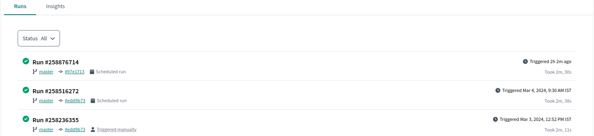
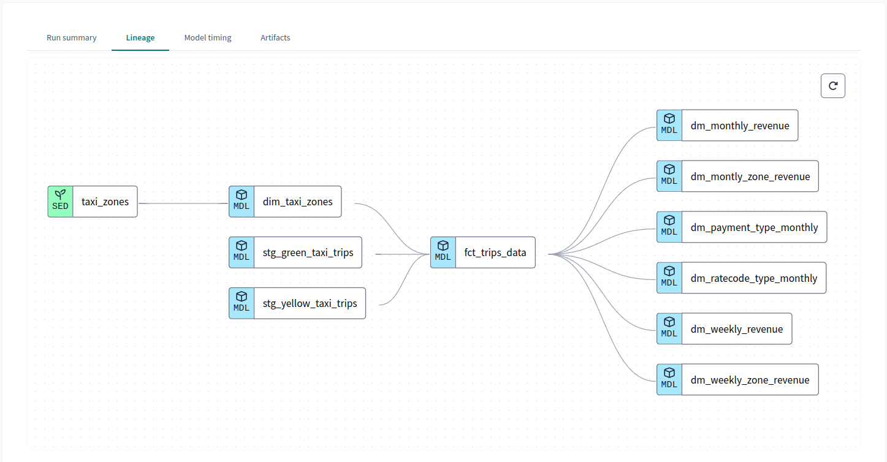

# NYC Taxi Data ETL

This module contains functions for extracting, transforming, and loading NYC taxi data from the [NYC Taxi & Limousine Commission](https://www.nyc.gov/site/tlc/about/tlc-trip-record-data.page) using the [`dlt`](https://dlthub.com/) library in Python.

## Introduction

The code provides a set of functions to retrieve, process, and store data from various NYC taxi trip datasets. It includes functions for extracting data, normalizing the schema, transforming it into a standardized format, and loading it into a data warehouse for further analysis. 


## Dashboard

You can view the Dashboard *(v1)* here: [View Dashboard](https://lookerstudio.google.com/reporting/f51c6640-4907-4b41-a1fd-72d2f32768dc)  


## Features

- Extracts and transforms yellow, green, and fhvhv taxi trip data.
- Supports retrieving data from remote sources via HTTP requests.
- Provides logging functionality to track data extraction and loading progress.
- Normalized data with snake case column name and schema included.

### Performace Analytics

Separate Runs:

    - Green Taxi: ~4m 31secs [2019-2023] 
    - Yellow Taxi: ~00 [2019-2023]

## Installation

### Linux:

Clone this repository to your local machine and install the required dependencies using pip:

```bash
git clone https://github.com/snehangsude/nyc_taxi_pipelines.git
cd nyc_taxi_pipelines

# Create separate env
python -m venv <name_of_env>
source <name_of_env>/bin/activate

pip install -r requirements.txt
```

## Usage

### Base requirements

- Need a GCP account if `config.toml --> destination` is set to bigquery. DuckDB is integrated with DLT. 
- Need a project to be created in GCP ([read more here](https://cloud.google.com/resource-manager/docs/creating-managing-projects)).

### Running the pipeline

The module can be used to extract and load NYC taxi trip data into a data warehouse. Here's how to use it:

- Follow Installation steps prior to following the below steps.
- Configure the module settings in `.dlt/config.toml`.
- Run the required bash script `run**.sh` to start the ETL process.
- Monitor the logs in `.logs/nyc_taxi_*.log` to track the progress and status of the ETL process.

> If you are trying to push to BigQuery you will need to set your environment variable with the below command:
```
export GOOGLE_APPLICATION_CREDENTIALS=/path/to/file/credentials.json 
```

*View sample folder for various samples.*

### Running DBT

*This is configured to be specifically running in DBT Cloud*

> **You will need to fork the repo in your GitHub profile.** 

- Open an account in DBT Cloud environment[DBT](https://cloud.getdbt.com/).
- Go to Settings --> Projects --> and setup Project details (Credentials, dataset name, etc).
- Select the forked repo and clone it to a new branch in the DBT IDE.
- Fix config variables as needed in the `dbt_project.yml` file.
- To run the pipeline you'd need to run `dbt build --select +fct_trips_data+ --vars '{'is_test_run': 'false'}'`

### DBT Documentation
    
You can view the [DBT Docs](https://cloud.getdbt.com/accounts/248130/jobs/543466/docs/#!/overview) here.

### DBT pipeline

#### Scheduled Jobs



#### Data Lineage




## License

This project is licensed under the MIT License - see the [LICENSE](https://github.com/snehangsude/nyc_taxi_pipelines?tab=MIT-1-ov-file) file for details.

## Contact

For questions or feedback, please contact the author:

Snehangsu De
Email: desnehangsu@gmail.com
GitHub: [snehangsude](https://github.com/snehangsude)
